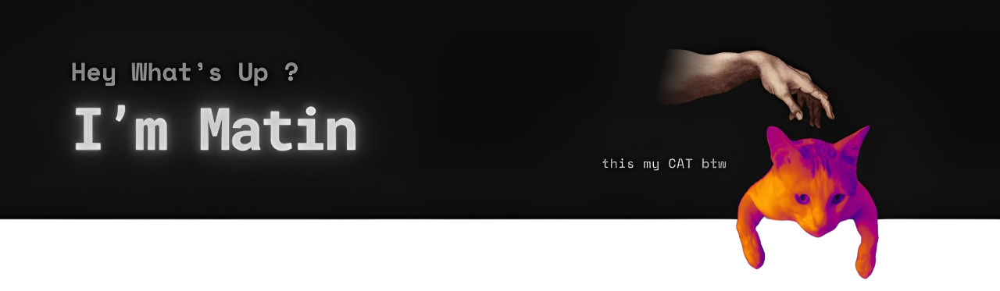

  

# Hi, I'm Matin 👋

💻 **WordPress Expert | Frontend Developer in progress**  
Building responsive, SEO-friendly, and high-performance websites.  
Currently learning **JavaScript & React** and sharing real-world projects here.

---

## 📊 GitHub Stats

  

---

## 🛠 Tech & Tools
- WordPress, PHP  
- HTML, CSS, JavaScript  
- React (learning)  
- Git & GitHub  

---

## 🚀 Vision
Creating a community where **no idea is left behind** — turning concepts into real solutions through collaboration and code.

---
