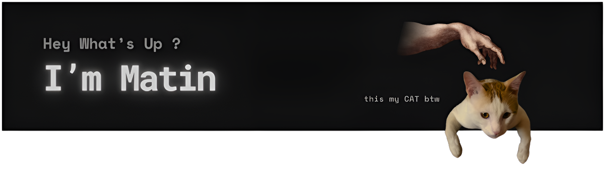
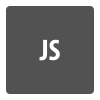

  

##  Overview
I have several years of experience in web design and development using tools like Webflow, WordPress, and Shopify (with custom coding). Currently, I'm focusing on Frontend Development to bring my startup ideas to life without limitations. I share my projects publicly to get feedback and connect with other developers.

##  What I'm working on
- Finishing the **JavaScript (ES6+)** Learning.  
- Building some practice project (currently doing [To Do Pro](https://github.com/matinfrz/To-Do-Pro)).
- Currently Learning -->        

 ##  Skills

  
  <!-- JavaScript -->
  
  

  <!-- CSS3 -->
  

  <!-- Git -->
  

  <!-- GitHub -->
  

  <!-- WordPress -->
  

  <!-- Elementor -->
    

